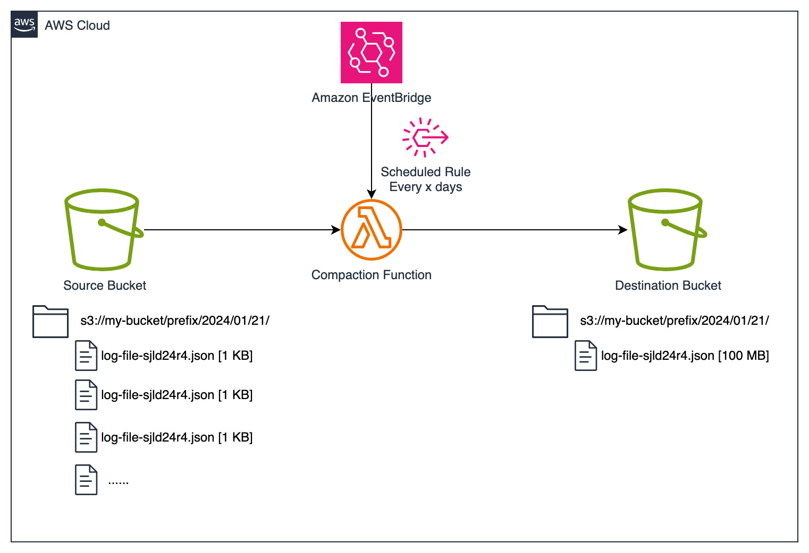
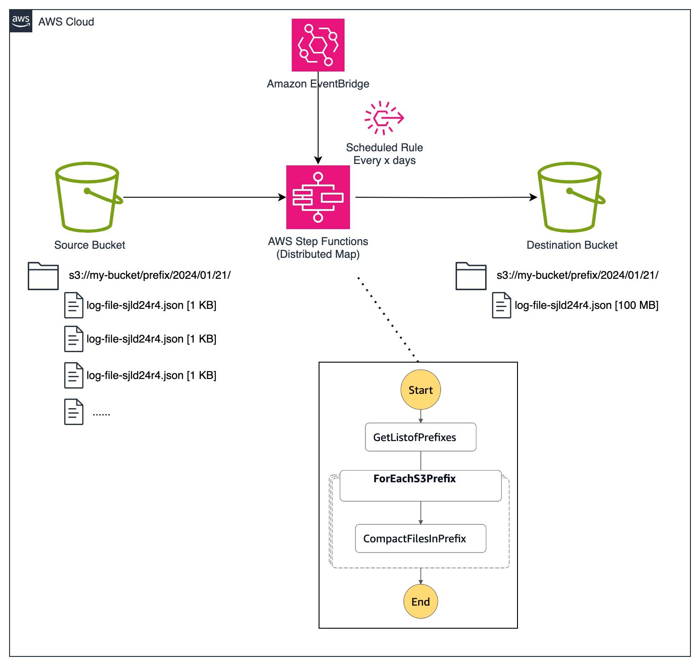

# Amazon S3 Small Object Compaction with AWS Lambda and AWS Step Functions

This solution deploys a serverless application to combine ("compact") small objects stored in a given [Amazon S3](https://aws.amazon.com/s3/) prefix into a single larger file. Larger files enable cost effective use of S3 storage tiers that have a minimum billable object size (e.g. 128 KB). It can also improve performance when querying data directly with [Amazon Athena](https://aws.amazon.com/athena/).

The sample code is written using the [AWS Cloud Development Kit](https://aws.amazon.com/cdk/) in Python. 

There are two solutions in this project to demonstrate the benefits of using [AWS Step Functions Distributed Map](https://docs.aws.amazon.com/step-functions/latest/dg/use-dist-map-orchestrate-large-scale-parallel-workloads.html) functionality to invoke Lambda functions in parallel and compact the objects faster:

1. A single Lambda function which iterates over a list of Amazon S3 prefixes to compact.
  
2. An AWS Step Function which uses Distributed Map to invoke a Lambda function for **each** prefix in a given list of objects to compact.
  


# Deploying

Pre-requisites:
- Python 3.7 or later including `pip` and `virtualenv`
- Node.js 14.15.0 or later

Install the latest version of the AWS CDK Toolkit using the Node Package Manager:
```
npm install -g aws-cdk
```

Creating a Python virtual environment:
```
python3 -m venv .venv
source .venv/bin/activate
```

Install the required Python package dependencies inside the virtualenv:
```
pip install -r requirements.txt
```

Deploy the CDK application passing in the context variables:
- `source_s3_uri` = the name of your S3 bucket containing the files to compact.
- `target_s3_uri` = the name of the bucket to write the compacted files to. This will be given s3:PutObject permissions.
- `previous_days` = how many days of historical data to compact and the frequency to run the EventBridge scheduled job.
```
cdk deploy -c source_s3_uri=s3://my-source-bucket/prefix/ -c target_s3_uri=s3://my-target-bucket/prefix/ -c previous_days=30
```

*To edit the date format of the expected S3 prefix partitioning modify the cdk.context.json file. The default is `%Y/%m/%d` e.g. my/prefix/2024/01/14/file.json.*

# Testing

By default there is an EventBridge scheduled rule to invoke the Step Function State Machine every `previous_days` specified at deployment. This rule is `DISABLED` by default. To enable this, update the `lambdaTriggerRule` in `compaction_stack.py` to `enabled=True` and redeploy the CDK application.

The standalone Lambda function `S3ObjectCompactionStack-standaloneCompactFunction` can be invoked using the following test event:
```
{
  "s3_source_uri": "s3://my-source-bucket/AWSLogs/123456789012/CloudTrail/eu-west-1/",
  "s3_destination_uri": "s3://my-dest-bucket/",
  "date_format": "%Y/%m/%d",
  "duration": 30
}
```

*Depending on the volume of data, this may take several minutes to run as each S3 prefix is being processed in sequence.*

The Step Function State Machine `CompactionStateMachine` can be invoked manually with the following inputs:
```
{
  "s3_source_uri": "s3://my-source-bucket/AWSLogs/123456789012/CloudTrail/eu-west-1/",
  "s3_destination_uri": "s3://my-dest-bucket/",
  "date_format": "%Y/%m/%d",
  "duration": 30
}
```

*This will process the same data in significantly less time as each prefix is being compacted in parallel.*


# Generating test data

There is a useful test utility that can be used to generate some random data and seed it across date partitions in a source S3 bucket:

```
./test/generate_test_data.py -r 1000 -f 10000 -b my-test-bucket
```

# Cleaning Up

Resources can be deleted by running:
```
cdk destroy
```